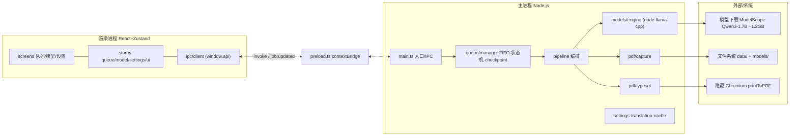

# 通事官 · 架构文档（As-Built）

> 状态：**当前实现快照**（2026-09-20）。
> 说明：本文描述**实际落地**的架构;早期规划见 [`architecture/TECH-SELECTION.md`](./architecture/TECH-SELECTION.md),其中若干选型已被自测数据推翻(见 §2.3)。
> 配套图:`docs/architecture/app-architecture.drawio`(draw.io 多页,可编辑),本页内嵌 Mermaid 便于直接阅读。

**一句话**:离线、本地、单机的英译中 PDF 翻译器。Electron 主进程用量化 LLM 推理(无云端、无 Python sidecar),Chromium 重排版输出中文 PDF。全中文 UI。

---

## 1. 技术选型总览

### 1.1 应用框架

| 层 | 选型 | 理由 |
|---|---|---|
| 桌面框架 | **Electron 33** | Node 原生模块(llama.cpp / onnxruntime / canvas)支持成熟;Chromium 自带 `printToPDF` 排版 |
| 构建 | **electron-vite 2.x** | 主/预加载/渲染三层统一构建,HMR;Rollup 期把纯 JS 依赖打进产物,避免运行期 ESM `require` |
| UI | **React 18 + TypeScript(strict)** | 生态成熟;`noUnusedLocals/Params` 常开,死代码在编译期即暴露 |
| 样式 | **Tailwind CSS 3** | 原子类,无运行时开销 |
| 状态 | **Zustand 4** | 轻量、无 Provider 树;跨屏导航/toast 用 `uiStore` |
| 打包 | **electron-builder 24(NSIS)** | 双击安装、可改安装目录、卸载零残留 |

### 1.2 PDF 处理

| 用途 | 选型 | 理由 |
|---|---|---|
| 文本/坐标提取 | **pdfjs-dist 3.x**(legacy build) | `getTextContent()` 给出坐标+字号+字体名;能解码 JPX(见 §3.1) |
| 图片字节提取 | **pdf-lib** | 直接取 DCTDecode/FlateDecode 原图字节 |
| 版面结构检测 | **PP-DocLayout-S(ONNX)** + `onnxruntime-node` | C1 通道,23 类文档版面;CPU EP ~50ms/页 |
| 像素渲染 | **@napi-rs/canvas** | 主进程内无头渲染(图区栅格化、检测输入),单原生模块 ~5MB |
| 排版(主) | **Chromium `printToPDF`** | 全新 A4 版面,中文排版质量最好 |
| 排版(兜底) | **pdf-lib + @pdf-lib/fontkit** | Chromium 失败时 in-place 绘制,子集字体内嵌 |
| 中文字体 | **Microsoft YaHei 子集**(Regular/Bold)+ **Consolas 子集** | 预子集化 ~12–15MB/个;弃 NotoSansSC 全量 |

### 1.3 翻译引擎(自测 A/B 后的最终结论)

| 候选 | 结果 | 依据 |
|---|---|---|
| **Qwen3-1.7B-Q4_K_M** | ✅ **主模型**(关思考,temp 0.1 / topK 20 / topP 0.9) | 自测质量/速度综合最优;GGUF 走 ModelScope 外挂下载 |
| Hy-MT2-1.8B(早期计划) | ❌ 未采用 | 收敛到 Qwen3 后不再作为主引擎 |
| opus-mt-en-zh(CT2) | ❌ 否决 | int8 输出退化(见 `MODEL-AB-2026-09.md`) |
| NLLB-200 | ❌ 否决 | 许可 CC-BY-NC,禁止商用 |

> 关键决策:**单模型、外挂下载、不打包进 EXE** —— 安装包保持精简,模型运行时按需拉取。详见 §4。

---

## 2. 总体架构

📐 draw.io:`app-architecture.drawio` → 页 **1-总体架构**



**进程边界与安全**:渲染进程无 Node 能力,一切经 `preload` 的 `contextBridge` 暴露的 `window.api`(类型化 IPC 面)。主进程把纯 JS 依赖(pdfjs/pdf-lib/fontkit)打进产物;`node-llama-cpp`/`onnxruntime`/`@napi-rs/canvas` 保持外部 + `asarUnpack`。

---

## 3. 翻译流水线

📐 draw.io 页 **2-翻译流水线**


状态机:`queued → extracting → translating → typesetting → exporting → done`,各阶段可 `paused/canceled/error`;暂停/取消经 `AbortController` 协作式传播;每译单元 **append-only checkpoint**,崩溃后断点续传。

### 3.1 提取(capture/flow.ts)
- pdfjs `getTextContent` → 按基线聚行 → 阅读顺序/分栏 → 段落合并(`joinLines` 去连字符)。
- 元素分类:标题/正文/代码/表格/图/页眉页脚。**纯几何 + 字体启发式**,集中在无原生依赖的 `line-utils.ts`(可单测)。
- 运行家具剥离、出血页码清理(保守,不吃正文)。
- **C1 版面检测**:PP-DocLayout-S 检测低 ink 稀疏图区,栅格化为图片块。
- **图片双通道**:pdf-lib 取字节(DCT/Flate);**JPXDecode(JPEG2000)取不了 → 用 pdfjs `renderClip` 栅格化**(否则整书插图丢失)。
- **重叠 placement 去重** `mergeOverlappingPlacements`:一个图形常由底图+软掩码画在同一页矩形,不去重会**每张图重复**。

### 3.2 翻译(pipeline.ts + llama-engine)
- 仅译标题/正文;**代码/表格/图 VERBATIM 不译**(硬红线)。
- 编号分批(每批多段带序号防错位)→ Qwen3 推理 → 校验(sentinel 多重集 / 数量级 / 空槽拒收)→ 占位符冻结/恢复(§A§ 公式/URL/引用)。
- **熔断**:处理 ≥200 单元且回退 >30% → 中止任务,绝不产出静默劣化译文。
- **缓存** `translation-cache`:key = model+temp+topK+topP+promptVersion,命中直接复用。

### 3.3 排版(typeset)
- 主路径:`blocksToHtml` → 隐藏 Chromium 窗口 `printToPDF`,全新 A4 版面。
- 兜底:`pdf-lib` `typesetFlow`(in-place),自适应字号 14→6pt。
- 导出:原子写 `tmp→rename`。

---

## 4. 体积压缩

📐 draw.io 页 **3-体积压缩** — 交付安装包 **~120 MB(不含模型)**。

| # | 手段 | 位置 | 收益 |
|---|---|---|---|
| ① | **模型外挂下载**,不打包 1.2GB GGUF | 运行期 ModelScope | 最大单项 |
| ② | Electron locales 55 → 2(zh-CN/en-US) | `after-pack.js` | ~40 MB |
| ③ | 删 onnxruntime GPU EP(DirectML/dxcompiler/dxil),检测只用 CPU EP | `after-pack.js` | ~36 MB |
| ④ | 删 node-llama-cpp `gitRelease.bundle`(源码构建 packfile) | `after-pack.js` | ~33 MB |
| ⑤ | 裁剪 ggml-cpu ISA 变体(留 x64/sse42/ivybridge/haswell/alderlake/zen4) | `after-pack.js` | ~2MB/文件 |
| ⑥ | `files` 排除:全量字体、cuda/arm64、darwin/linux、lucide-react | `package.json` | 数十 MB |
| ⑦ | 字体子集化(YaHei/Consolas ~12–15MB),弃 NotoSansSC 全量 | `assets/fonts` | -13 MB |
| ⑧ | `asar` 打包 + `asarUnpack` 仅原生模块;`npmRebuild:false` | `package.json` | 结构精简 |
| ⑨ | NSIS `compression: maximum`(LZMA) | `package.json` | 安装包再压缩 |

---

## 5. 迭代质量把控

📐 draw.io 页 **4-质量把控**

多层门禁,提交前无一例外:

| 层 | 命令 | 内容 |
|---|---|---|
| 类型 | `tsc --noEmit`(strict + noUnused) | 编译期暴露未用/类型错 |
| 回归 | `npm run gate` = typecheck + `regression.__test__.ts` | **R1–R24 纯函数单测**,<1s |
| 结构 | `npm run verify` | **54 项**结构不变式(package/产物/源码/3g 回归不变式/资源/asar) |
| 端到端 | `e2e-test.ts` | 12 页快测 / 全书 353 页;黄金样例 `docs/E2E-输出样例-*.pdf` |
| 对照 | 人工控制测试 | 改表格/代码检测后 **Manning 9 张真表格必须存活**(防误伤) |
| 便携 | `install-drill.ps1` | 装→跑→卸 端到端,**卸载零残留** |
| 运行期 | 熔断 | 翻译回退 >30% 即中止 |

**TDD 防回归闭环**:
1. 先在 `regression.__test__.ts` 写**红色 R# 用例**(旧行为必须失败);
2. 修代码变绿;
3. 无法单测的时序约束固化进 `verify-build.js` 结构不变式;
4. 台账 `docs/REGRESSION.md` · 坑 `docs/KNOWN-ISSUES.md` · 复盘 `docs/LESSONS-2026-09.md`。

**核心原则**:一切自测(不信外部报告,A/B ≥ 50 例);任何改动先测、有提升才采纳;修根因而非点修;运行期文件只落安装目录 `data/`、`models/`。

---

## 6. 目录结构(As-Built)

```
electron/
├─ main.ts / preload.ts          # 入口 + 安全 IPC 面
├─ pipeline.ts                   # 4 阶段编排 + 熔断
├─ queue/    manager · stateMachine · checkpoint
├─ models/   manager · engine-manager · llama-engine · registry · translation-cache · gpu · cpu-info
├─ pdf/
│  ├─ capture/  flow · line-utils(纯函数) · page-renderer · layout-detector(C1)
│  └─ typeset/  chromiumPrint(主) · htmlFlow · flow(pdf-lib 兜底) · measure
├─ regression.__test__.ts        # R1–R24
shared/types.ts                  # 跨进程类型 + IPC API 面
renderer/src/{screens,store,components}
scripts/  verify-build.js · after-pack.js · copy-pdf-worker.js · install-drill.ps1
assets/   fonts/(子集) · layout/(PP-DocLayout ONNX) · icon
```

---

## 7. 相关文档索引

- 选型(早期计划):`docs/architecture/TECH-SELECTION.md`
- 模型 A/B:`docs/MODEL-AB-2026-09.md` · 基准 `docs/MODEL-BENCHMARK.md`
- Gap 分析:`docs/GAP-ANALYSIS-2026-09.md` · 经验教训 `docs/LESSONS-2026-09.md`
- 回归台账 `docs/REGRESSION.md` · 已知坑 `docs/KNOWN-ISSUES.md`
- 开发指南 `docs/DEVELOPMENT-GUIDE.md` · 用户指南 `docs/USER-GUIDE.md`
